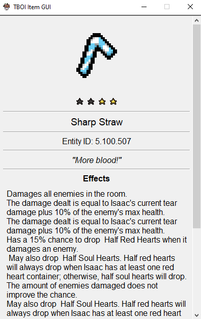

# TBOI Item GUI

This project contains a program written in python that allows analyzing items that the user hovers over in TBOI and provides information extracted from the TBOI wiki.

# How to use

- After running the code, you will be able to observe that the program runs constantly as you are in a situation where you do not know the item. You can open the program, hover the mouse and see what it is, obviously it is subject to not being able to analyze it or the program having several answers.
- Pressing the space bar pauses the scan and can continue when you press it again

# Code specifications

The program is written entirely in Python with dependencies such as:
- opencv-python
- pyautogui
- numpy
- Pillow
- requests
- beautifulsoup4
- tkinter

Item information is scraped 100% from the <a href="https://bindingofisaacrebirth.fandom.com/wiki/Binding_of_Isaac:_Rebirth_Wiki">TBOI wiki</a>

